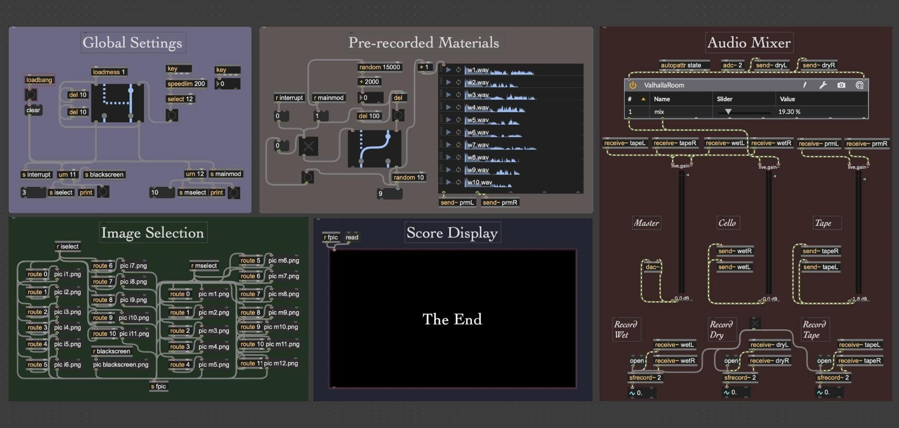

# MOSAIC
## Modular Open Score Arranger and Indeterminate Composition

*MOSAIC* is a Max/MSP patch and accompanying cello composition created in 2024.

It is a framework for modular, notated compositions, loosely inspired by 20th-century open scores such as *Piano Sonata No. 3* (Boulez) and *Klavierstück XI* (Stockhausen).
Rather than instructing the performer to determine the order of events, the piece assembles independent notated fragments in real time using a simple algorithm.

In performance, the cellist reads notated fragments as they appear on screen, navigating the score with a foot pedal.
At the same time, prerecorded samples are triggered at random intervals, creating brief interruptions.
The work was premiered in 2024 and recorded shortly afterward.

[Program Note](mosaic.pdf)
